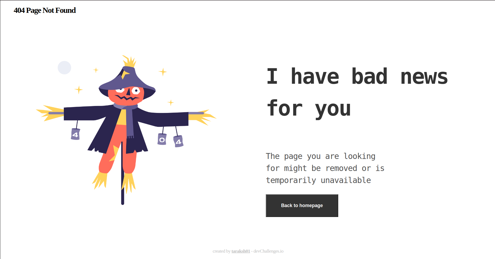
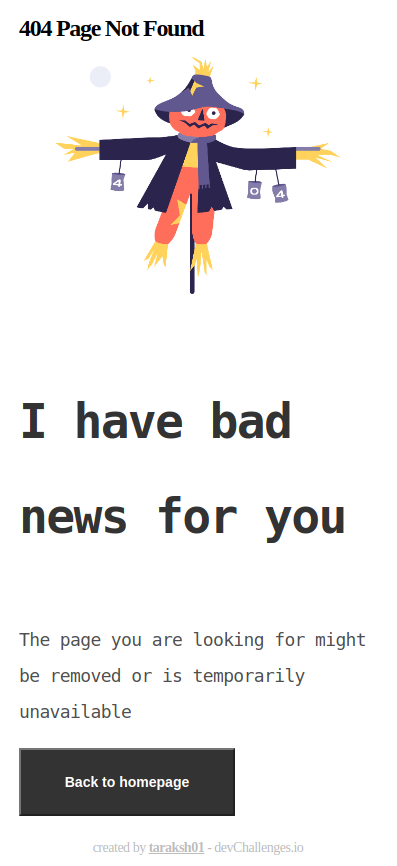

<h1 align="center">404 Page Not Found</h1>

   Solution for a challenge from  <a href="http://devchallenges.io" target="_blank">Devchallenges.io</a>.

  <h3>
    <a href="https://taraksh01.github.io/404-page-not-found/">
      Demo
    </a>
     | 
    <a href="https://github.com/taraksh01/404-page-not-found">
      Solution
    </a>
     | 
    <a href="https://devchallenges.io/challenges/wBunSb7FPrIepJZAg0sY">
      Challenge
    </a>
  </h3>

<!-- TABLE OF CONTENTS -->

## Table of Contents

- [Overview](#overview)
  - [Built With](#built-with)
- [Features](#features)
- [Contact](#contact)
- [Acknowledgements](#acknowledgements)

<!-- OVERVIEW -->

## Overview

This is a simple Error page to show user for both mobile and desktop version.

- You can view the live preview of the page at [404 Page Not Found](https://taraksh01.github.io/404-page-not-found/).
- Making this project i learned how to use medea atrule to make page responsive to different screen sizes.

### Built With

<!-- This section should list any major frameworks that you built your project using. Here are a few examples.-->

- [HTML]
- [CSS]

## Features

<!-- List the features of your application or follow the template. Don't share the figma file here :) -->

This application/site was created as a submission to a [DevChallenges](https://devchallenges.io/challenges) challenge. The [challenge](https://devchallenges.io/challenges/wBunSb7FPrIepJZAg0sY) was to build an application to complete the given user stories.

## Acknowledgements

<!-- This section should list any articles or add-ons/plugins that helps you to complete the project. This is optional but it will help you in the future. For exmpale -->

- [Steps to replicate a design with only HTML and CSS](https://devchallenges-blogs.web.app/how-to-replicate-design/)

## Contact

- Website [your-website.com](https://{your-web-site-link})
- GitHub [@tarksh01](https://github.com/tarksh01)
- Twitter [@taraksh01](https://linkedin.com/in/taraksh01)
